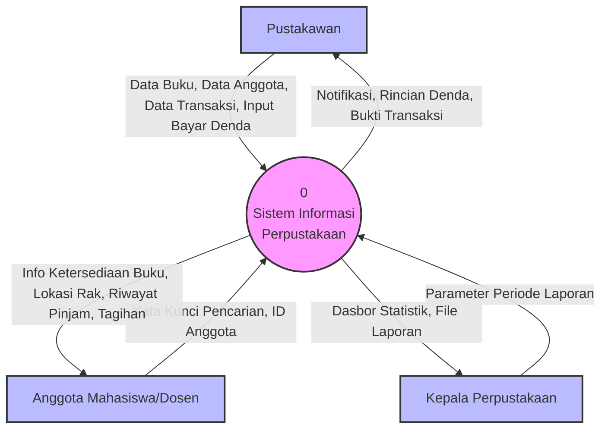

```mermaid
flowchart TD
    E1[Pustakawan]
    E2[Anggota Mahasiswa/Dosen]
    E3[Kepala Perpustakaan]

    Sistem((0 <br> Sistem Informasi <br> Perpustakaan))

    E1 -- "Data Buku, Data Anggota, Data Transaksi, Input Bayar Denda" --> Sistem
    Sistem -- "Notifikasi, Rincian Denda, Bukti Transaksi" --> E1

    E2 -- "Kata Kunci Pencarian, ID Anggota" --> Sistem
    Sistem -- "Info Ketersediaan Buku, Lokasi Rak, Riwayat Pinjam, Tagihan" --> E2

    E3 -- "Parameter Periode Laporan" --> Sistem
    Sistem -- "Dasbor Statistik, File Laporan" --> E3

    style Sistem fill:#f9f,stroke:#333,stroke-width:2px
    style E1 fill:#bbf,stroke:#333,stroke-width:2px
    style E2 fill:#bbf,stroke:#333,stroke-width:2px
    style E3 fill:#bbf,stroke:#333,stroke-width:2px
```
